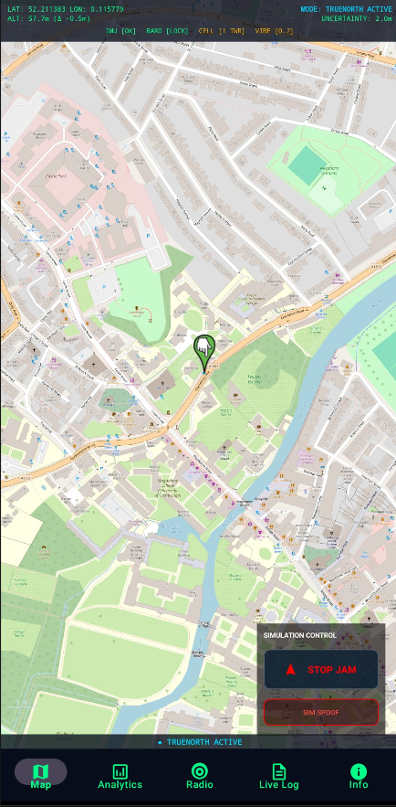
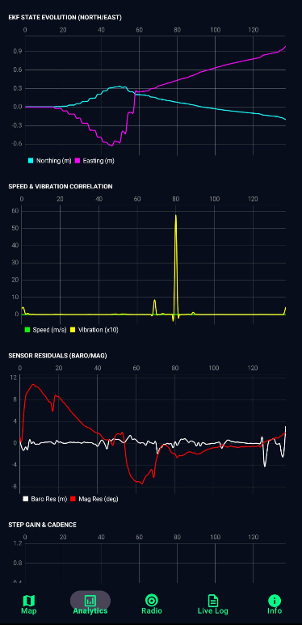
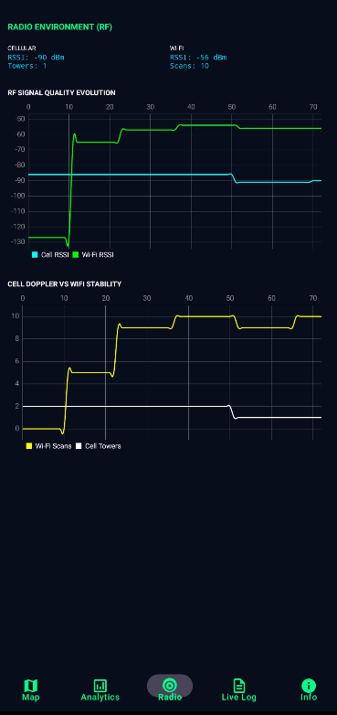
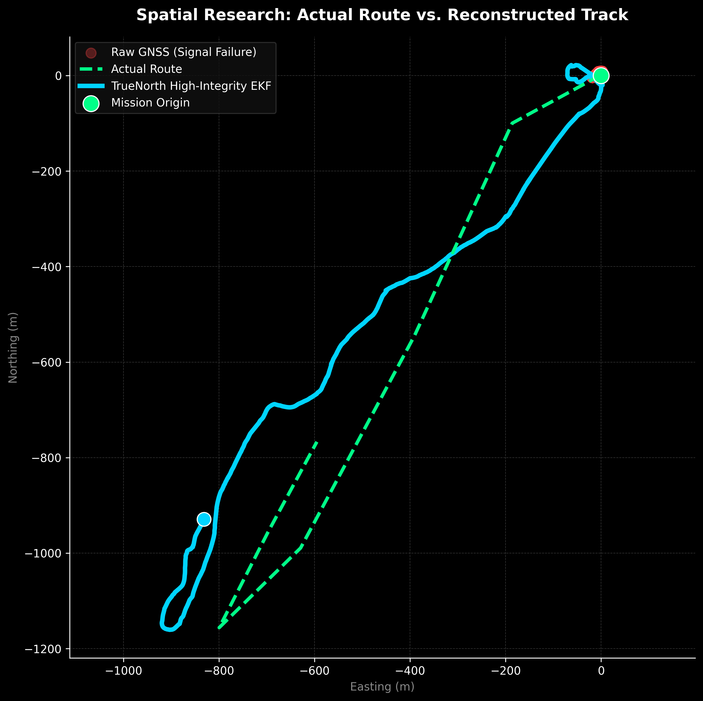
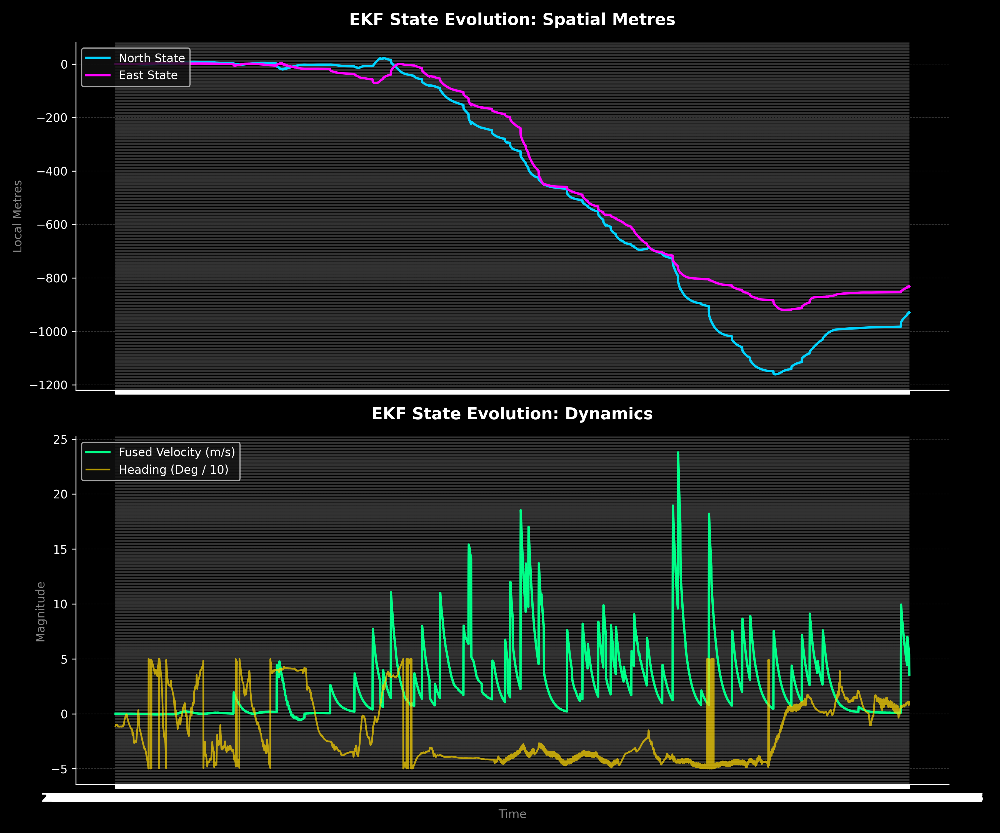
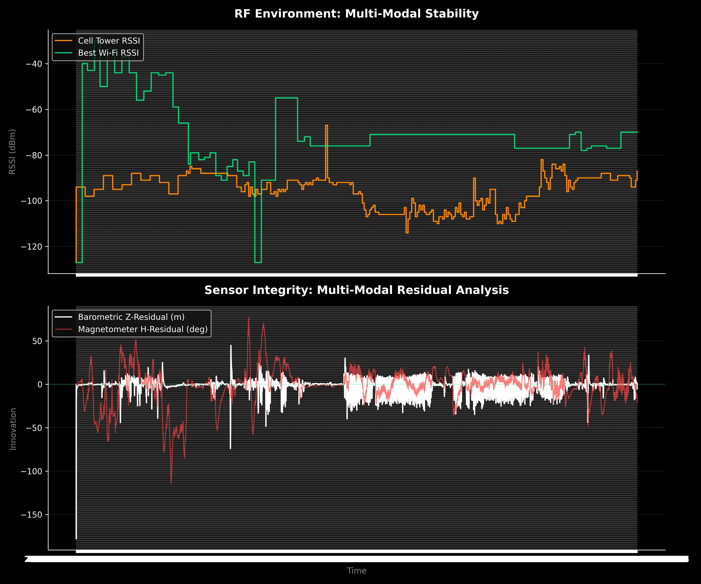

# TrueNorth: High-Integrity Navigation for a GPS-Denied World

TrueNorth is an edge-AI software engine designed to keep commercial aircraft on track when GPS/GNSS signals are jammed or spoofed.

### The Idea
Rather than waiting for uncertified hardware like quantum clocks, TrueNorth uses what’s already on the plane. It runs a dynamically weighted **Extended Kalman Filter (EKF)** that fuses physically independent inputs—Inertial Reference Systems, barometric pressure, and even the passive Doppler shift of ambient LEO satellite signals (like Starlink). By cross-referencing these "un-spooofable" sources, the system can detect a GPS "impossible jump" and maintain a corrected track, ensuring pilots always know their true position.

### Visual Overview

  
  
  

### Research-Grade Technical Analysis
Deep-dive mission analysis extracted from high-fidelity 20Hz telemetry:

  

- **Spatial Trajectory Research**: The **Local Metric Grid** above tracks the system's path through Cambridge. The red clusters represent total GNSS failure (signal stuck at origin), while the solid cyan track demonstrates TrueNorth's ability to maintain a continuous, high-fidelity solution over 1.2km using only fused inertial and environmental sensors.

  
  

- **EKF State Evolution (Left)**: Visualization of the 5-state vector ($N, E, A, H, V$) showing convergence and stability across spatial metres and dynamics (velocity/heading).
- **Multi-Modal Integrity (Right)**: Correlates raw RF signal environment stability (Cell/Wi-Fi RSSI) against sensor residuals. This proves the system's ability to identify and bound "spoofed" innovation in real-time.

### Why It Matters
When GPS fails, aircraft lose their primary navigation and are often forced to descend into denser air or take longer routes, burning 200–500kg of extra fuel per flight. By maintaining RNP separation standards, TrueNorth prevents these diversions, saving airlines millions in operational costs and avoiding thousands of tonnes of avoided carbon emissions annually.

### Core Architecture
TrueNorth's core logic leverages the full capability of high-grade sensor suites:
*   **Multi-Modal Fusion**: Fusing IMU, Barometer, and 5G/Wi-Fi signals to bound inertial drift.
*   **Spoofing Defence**: A real-time integrity monitor that flags GPS anomalies and automatically down-weights compromised data.
*   **Professional Dashboard**: A 5-tab diagnostic suite featuring 20Hz telemetry logging and real-time EKF dynamics graphing.

### The Roadmap
Initially designed as an **Electronic Flight Bag (EFB)** advisory tool, TrueNorth offers a fast-tracked path to the cockpit that bypasses the decade-long certification cycles of new hardware. It represents an agile, software-first response to the evolving reality of electronic warfare in our skies.
